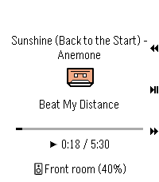
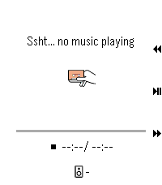

# PebbleMA

This project is in no way associated with Music Assistant. It's an independent tool. 

Displays the currently playing song on your wrist! With playback controls (play/pause, next, previous, volume up/down).

## TODO

- We currently only display data for the first player we find that's in a playing state. We don't handle player groups too well, nor do we allow selections.

## Screenshots

