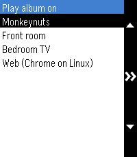

# PebbleMA

This project is in no way associated with Music Assistant. It's an independent tool. 

Displays the currently playing song on your wrist! With playback controls (play/pause, next, previous, volume up/down).

Initiate playback: pressing the speaker name will open a list of recently played albums. Selecting an album will prompt you which player you which to enqueue that album on.

Note: currently, long press button actions are not possible with the Alloy framework. As such I have temprarily disabled volume controls. A fix is on the way, after which I can re-enable this, see https://github.com/Moddable-OpenSource/pebble-examples/issues/12.

## TODO

- We currently only display data for the first player we find that's in a playing state. We don't handle player groups too well, nor do we allow selections.
- We poll for 10 recent albums only. We are operating very close to the limits in available memory here, so it's hard to expand functionality much further.

## Screenshots

## BDS

This project endorses the [Boycott, Divestment, Sanctions](https://bdsmovement.net/) movement against the apartheid state of Israel, in support of Palestinian human rights.

Support requests originating from Israel will not be addressed. Issues and pull requests from anyone, anywhere, that improve the software for everyone else, remain welcome.
